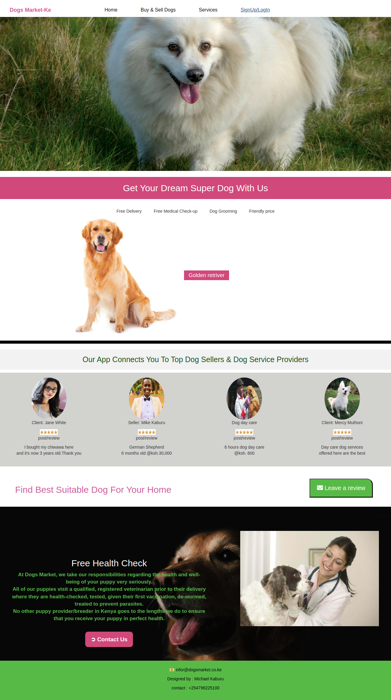

# DogsMarket-Ke App
This is a dogs market and services app.

## Description
The app uses ,HTML,CSS ,JAVA SCRIPT,REACT.JS language for front-end and Ruby language for back-end to program it . The DogsMarket-Ke app has the following user interactivity :
1) A well designed home page.
2) A home page has a contact us button.
3) The app has navbar to navigate to the desired pages.
4) The app has a buy and sell page where one can view top dog breeds and can click to request for one or post to sell a dog.
5) A user is able to post a dog and delete the dog post from the buy and sell page.
6) A user is also able to book for dog services via the services section.

## Project-Setup-Instructions
1)Installation of the Visual studio code .
2)Git cloning the repository .
3)install the app dependancies by running `npm install`.
4)After the node-modules packages and other dependancies have been installed run `npm start` or `npm run start` to run the app.

## Project's-Video-Link
https://drive.google.com/file/d/1ZyhHllErEcGhgKNMblNnU4AnibJNaT8X/view

## GitHub-Front-End-Repo-Link
https://github.com/Kaburu12/DogsMarket-Client.git

## GitHub-Back-End-Repo-Link
https://github.com/Kaburu12/DogsMarket-server.git

## Backend-End-Poits-Links
https://dogsmarket1234.herokuapp.com/dogs

https://dogsmarket1234.herokuapp.com/

## Project's-Live-Link
https://dogsmarket-ke.netlify.app/

## Home Page Screenshot

## Technology-Used
HTML - Was used as a template to hold the React components of the app via the root div. 
CSS styling-which was used to style the User Interface.
JS - Java Script is used to make the website interactive.
JSX- JavaScript XML allows us to write HTML elements in JavaScript and place them in the DOM .JSX converts HTML tags into react elements.
Ruby- used to create a back-end API.
Heroku - Heroku used host our backend online .

## Known-Bugs
The project works correctly and interactively.

## License
Copyright (c) [2022] [Michael Kaburu Rapando] Permission is hereby granted, free of charge, to any person obtaining a copy of this software and associated documentation files (the "Software"), to deal in the Software without restriction, including without limitation the rights to use, copy, modify, merge, publish, distribute, sublicense, and/or sell copies of the Software, and to permit persons to whom the Software is furnished to do so, subject to the following conditions:

The above copyright notice and this permission notice shall be included in all copies or substantial portions of the Software.

THE SOFTWARE IS PROVIDED "AS IS", WITHOUT WARRANTY OF ANY KIND, EXPRESS OR IMPLIED, INCLUDING BUT NOT LIMITED TO THE WARRANTIES OF MERCHANTABILITY, FITNESS FOR A PARTICULAR PURPOSE AND NONINFRINGEMENT. IN NO EVENT SHALL THE AUTHORS OR COPYRIGHT HOLDERS BE LIABLE FOR ANY CLAIM, DAMAGES OR OTHER LIABILITY, WHETHER IN AN ACTION OF CONTRACT, TORT OR OTHERWISE, ARISING FROM, OUT OF OR IN CONNECTION WITH THE SOFTWARE OR THE USE OR OTHER DEALINGS IN THE SOFTWARE.

## Author
By Kaburu Michael .

## Support-And-Contact-Details
Email address: kabururm@gmail.com | Slack:Michael Kaburu |
Github :Kaburu12